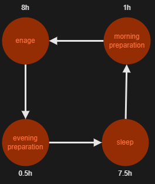
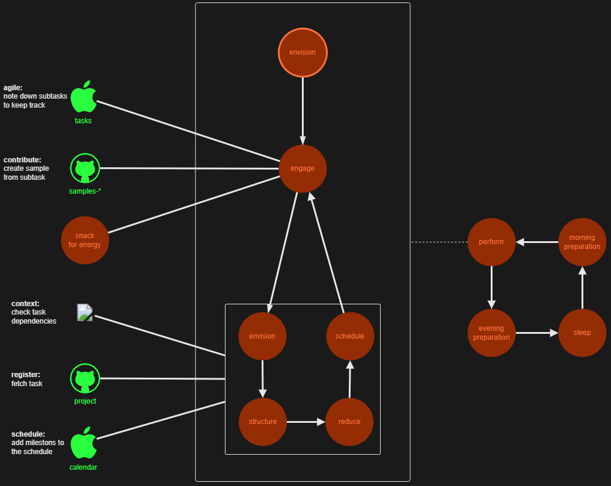
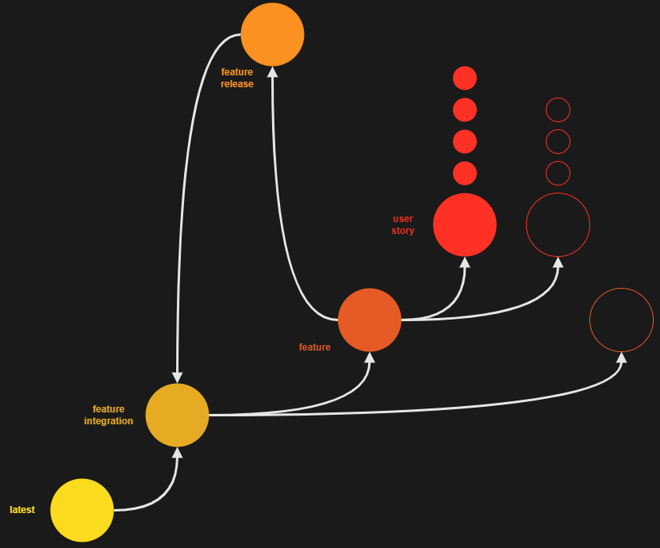
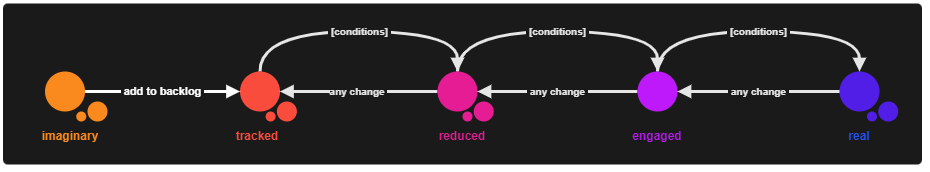
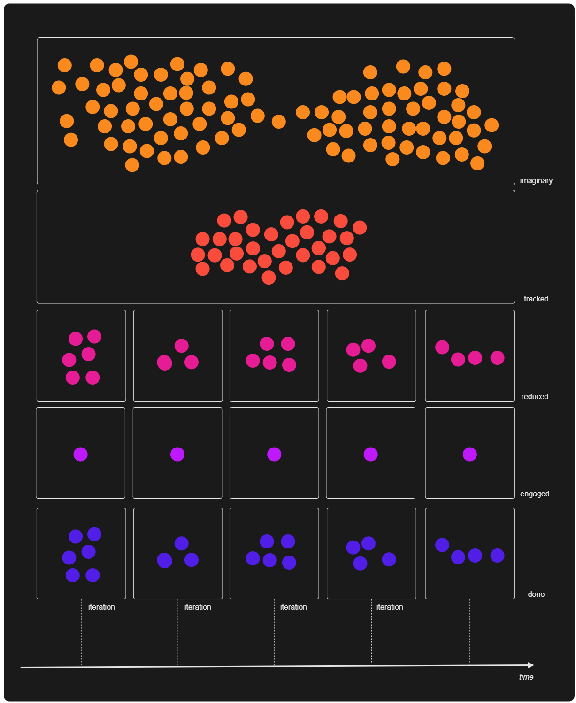
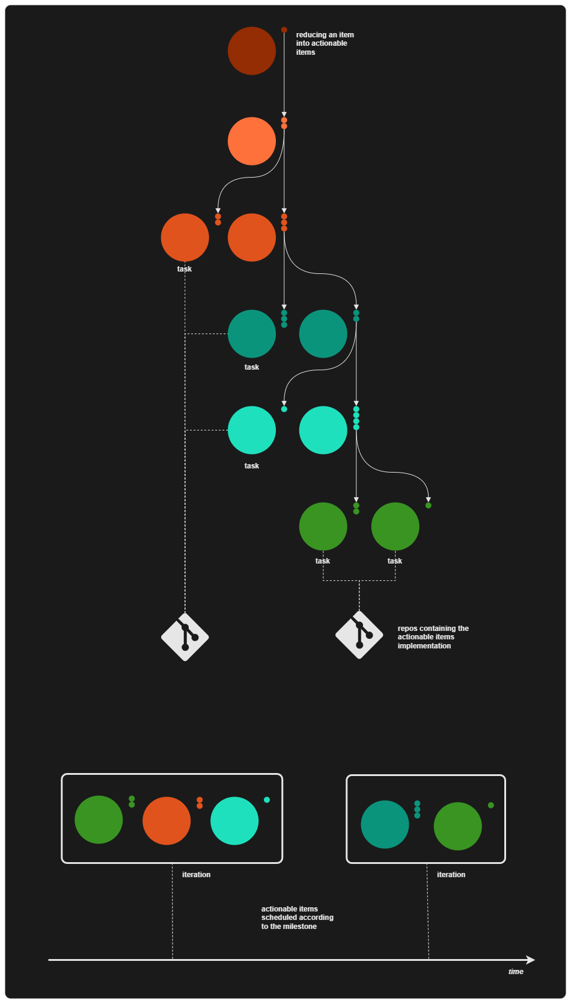
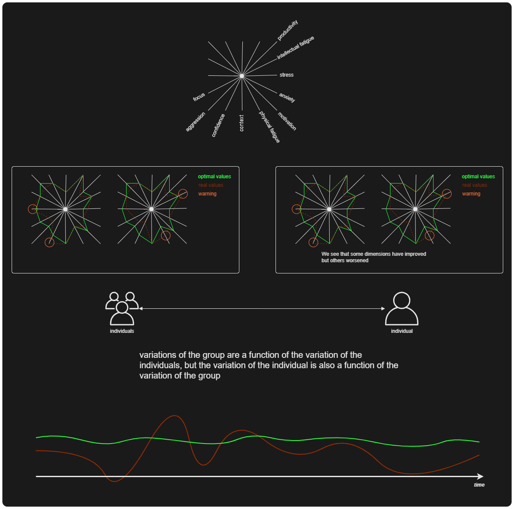
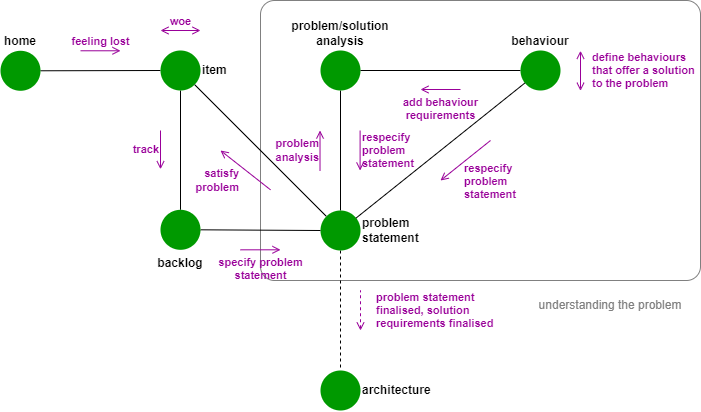
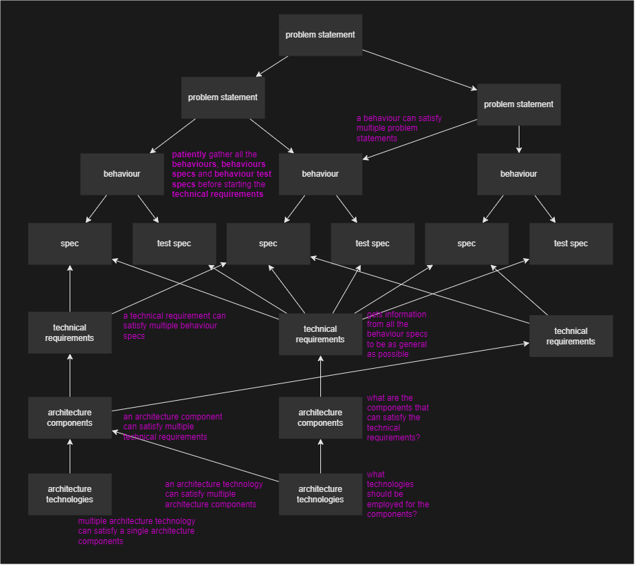

.. raw:: html

   

=============
The Manifesto
=============

Main Flow
---------

The main flow is the sequential iteration of the states ``sleep``, ``morning-preparation``, :ref:`engage-flow <engage_flow>`, ``evening-preparation``.

.. _engage_flow:

Engage Flow
-----------

The ``engage-flow`` starts by ``envisioning`` what to engage with. This can be achieved by consulting with the `backlog network graph <https://www.duckduckgo.com>`_ (for **context**), the `backlog <https://github.com/orgs/lifespline/projects/2>`_ (for **details**) and the `schedule <https://www.duckduckgo.com>`_ (for **scheduled milestones**). Knowing what to engage with, proceed engaged in full focus. The occurring subtasks (0.8 of them) must be logged as samples ``lifespline/samples-*`` so that they can be practiced upon later. Keep track of the subtasks on the `ipad notes <https://www.duckduckgo.com>`_ (to prevent loss of **context**). When the task is finished, you must to through the states of ``envision``, ``structure``, ``reduce`` and ``schedule`` *TODO*. When these states have been finished, one iteration has been completed, and the new ``engaged`` iteration can commence.

.. _versioning_and_control_flow:

Versioning and Control Flow
---------------------------

Reducing From Imaginary To Real
-------------------------------

Group And Individual Productivity Variation
-------------------------------------------

.. _problem_analysis_flow:

Development Flow
----------------

The ``problem-analysis-flow`` is understanding a problem statement before beginning the development of a solution. This step is very important because often the problem statement requires iterations of analysis before the problem statement is specified sufficiently in order to be tackled.

.. _backlog:

Backlog
~~~~~~~

Track the ``item``.

.. _prob_statement:

Problem Statement
~~~~~~~~~~~~~~~~~

Add problem statement, or *that which seems to best describe* the ``item``, without having any consideration about what might solve the problem. The problem statement is a set of problem statements. Each set maps to a ``product feature``. The problem statement maps to a ``product`` that satisfies the problem statement.

.. _prob_analysis:

Problem/Solution Analysis
~~~~~~~~~~~~~~~~~~~~~~~~~

If the :ref:`problem statement <prob_statement>` consists of multiple problem statements, **there is some underlying problem that can be analyzed from within the framework of a possible solution to all the problem statements** (we assume a problem can only be analyzed from within the framework of a possible solution). The analysis outputs a generic solution that will satisfy all the problem statement.

.. code-block:: rst

   Problem Statement
   ┣╸ <Problem Statement 1>
   ┣╸ ...
   ┗╸ <Problem Statement M>

.. note::

    It's important to try to discuss a solution to all the problem statements so that each problem statement is treated as an instantiation of a generic problem.

.. note::

    The solution **MUST NOT** be technical but merely conceptual. The problem statement exists only in the conceptual level (e.g.: a network graph to map a backlog is a concept, rendering the network graph with a pyhon lib in a jupyter notebook is a technical detail).

.. _behaviour:

Behaviour
~~~~~~~~~

With the conceptual solution from the :ref:`problem analysis <prob_analysis>`, specify the behaviours that will satisfy each problem statement.

.. code-block:: rst

   Behaviours: <Problem Statement 1>
   ┃
   ┣╸ BEHAVIOUR 1
   ┃  ┃
   ┃  ┣╸SPEC
   ┃  ┗╸TEST SPEC
   ┣╸ ...
   ┗╸ BEHAVIOUR N
      ┃
      ┣╸SPEC
      ┗╸TEST SPEC

   ...

   Behaviours: <Problem Statement M>
   ┃
   ┣╸ BEHAVIOUR N + 1
   ┃  ┃
   ┃  ┣╸SPEC
   ┃  ┗╸TEST SPEC
   ┣╸ ...
   ┗╸ BEHAVIOUR P
      ┃
      ┣╸SPEC
      ┗╸TEST SPEC

The problem statement maps to **behaviour specifications** and the corresponding **behaviour verification tests**. The behaviours and the behaviour verification tests should be written in a mid-level language for automation purposes. These tests are not to be mistaken with the implementation unit tests, these are behavioural tests and specify what the behaviour must guarantee.

Typically the behaviour specifications aren't all necessary, it's crucial to identify which behaviours are closest to the problem statement so that the **value throughput** is always high. Add the unnecessary behaviour specs to tackle them at a later point in time.

Each problem statement maps to a ``product feature`` and each behaviour maps to a ``product feature behaviour`` or a ``user story``.

.. note::

    It's important to **finish the behaviour and behaviour test specifications for all the problem statements (features)** before starting to think of the architecture for the overall solution. This approach protects from having to redesign the architecture from feature to feature (as these may vary in what they require from the architecture).
    
    This is nevertheless bound to happen, the approach simply tries to minimize it and maximizing value throughput.

.. note::

    The behaviours hierarchy establish a correspondence between the behaviour and the problem statement. It's important to visualize which behaviour satisfy which problem statement, and which technical requirements satisfy which behaviours, *etc.*, all the way down to **who wrote which line of code when: 100% transparency**.

    TODO: automate

Having finalized all the problem statements' behaviours it is possible to analyse the :ref:`architecture for a tecnhical solution <architecture>`.

.. _technical_requirements:

Technical Requirements
~~~~~~~~~~~~~~~~~~~~~~

Gather information from all the **behaviour** and **behaviour test specifications** from all the **problem statements** and consider the **technical requirements** of these specifications, establishing a correspondence (TODO: automate this process).

.. note::

    The specificity of the **technical requirements** is a function of the specificity of the **behaviour specifications**, *i.e.*, the **technical requirements** are to be abstracted as much as possible from their implementation.

    *Example*: If the **behaviour specification** suggests that the data layer will hold different file types, then the **technical requirement** should detail a technology that accommodates for different file types, otherwise it should abstain from specifying the data persistency technology.

.. note::

    The technical requirements hierarchy establish a correspondence between the technical requirements and the behaviour. It's important to visualize which technical requirements satisfy behaviour satisfy which problem statement, and which technical requirements satisfy which behaviours, *etc.*, all the way down to **who wrote which line of code when: 100% transparency**.

.. _architecture_components:

Architecture Components
~~~~~~~~~~~~~~~~~~~~~~~

Gather information from all the **technical requirements** and consider the **architecture components** that answer all of them, establishing a correspondence (TODO: automate this process).

.. note::

    The specificity of the **technical requirements** is a function of the specificity of the **behaviour specifications**, *i.e.*, the **technical requirements** are to be abstracted as much as possible from their implementation.

    *Example*: If the **behaviour specification** suggests that the data layer will hold different file types, then the **technical requirement** should detail a technology that accommodates for different file types, otherwise it should abstain from specifying the data persistency technology.

.. _architecture_technologies:

Architecture Technologies
~~~~~~~~~~~~~~~~~~~~~~~~~
